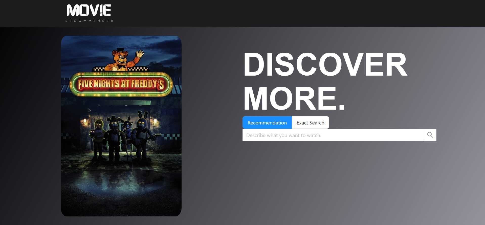
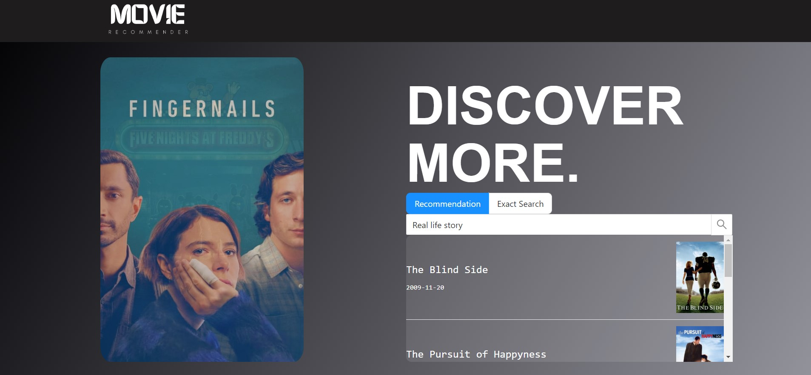
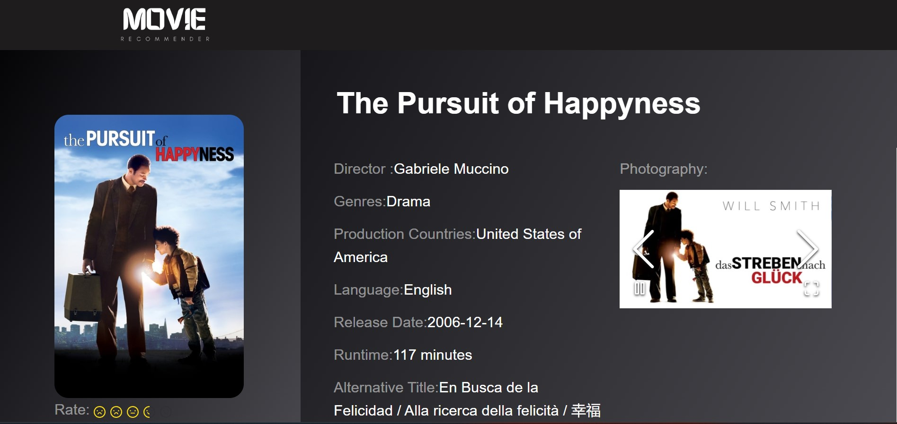

# Movie Recommender

## Project Description

Movie Recommendar is a user-friendly web application that facilitates the exploration of your favorite movies by providing information on ratings, cast and crew details, and more.  This project combines multiple technologies and frameworks to create a seamless movie recommendation experience.

## Features

- **Movie Information:** Explore detailed information about your favorite movies, including ratings, cast/crew details, and more.
- **Personalized Recommendations:** Get personalized movie recommendations based on your descriptions and preferences using OpenAI's GPT-3.5-Turbo Model API.
- **User-Friendly Interface:** Enjoy a user-friendly and intuitive web interface built with ReactJS for the frontend and Node.js and Flask for the backend.

## Tech Stack

- **Frontend:** ReactJS, Tailwind
- **Backend (Node.js):** Node.js, Express
- **Backend (Python):** Flask
- **API Integration:** The Movie Database (TMDb) API, OpenAI's GPT-3.5-Turbo Model API

## Installation

### Frontend (ReactJS)

To run the frontend of Movie Recommendar, follow these steps:

1. Ensure you have [Node.js](https://nodejs.org/) installed on your system.

2. Navigate to the `frontend` directory of your project in the terminal.

3. Run the following command to install the necessary dependencies:

   ```bash
   npm install
   ```

4. After the dependencies are installed, start the development server:

   ```bash
   npm start
   ```

5. The frontend will be accessible at `http://localhost:3000` in your web browser.

### Backend (Node.js)

The backend of Movie Recommendar is built using Node.js and Express. To start it, follow these steps:

1. Navigate to the root directory of your project in the terminal.

2. Run the following command to install the Node.js backend dependencies:

   ```bash
   npm install
   ```

3. Once the dependencies are installed, start the Node.js backend server using nodemon:

   ```bash
   nodemon app.js
   ```

4. The Node.js backend will be accessible at the specified port and routes defined in your application.

### Backend (Python)

The Python backend of Movie Recommendar is built using Flask. To start it, follow these steps:

1. Navigate to the `backend-python` directory of your project in the terminal.

2. Create a virtual environment (optional but recommended):

   ```bash
   python -m venv venv
   source venv/bin/activate  # On Windows, use `venv\Scripts\activate`
   ```

3. Install the required Python packages:

   ```bash
   pip install -r requirements.txt
   ```

4. Start the Flask backend:

   ```bash
   flask run
   ```

5. The Python backend will be accessible at the specified port and routes defined in your application.

## Usage

Once the frontend and backends are up and running, you can start using the Movie Recommendar web application to explore movies and receive personalized recommendations.

## Screenshots




